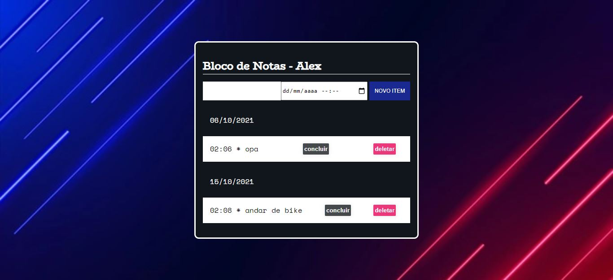

Projeto de bloco de notas, onde é possível armazenar tarefas no localStorage do navegador.
Para Gravar uma mensagem é necessario adicionar um texto e selecionar uma data
Para acessar o projeto é necessario apenas rodar o index.html ou acessar [ESTE LINK](https://alexricc2.github.io/bloco-de-notas/) da página no github pages 